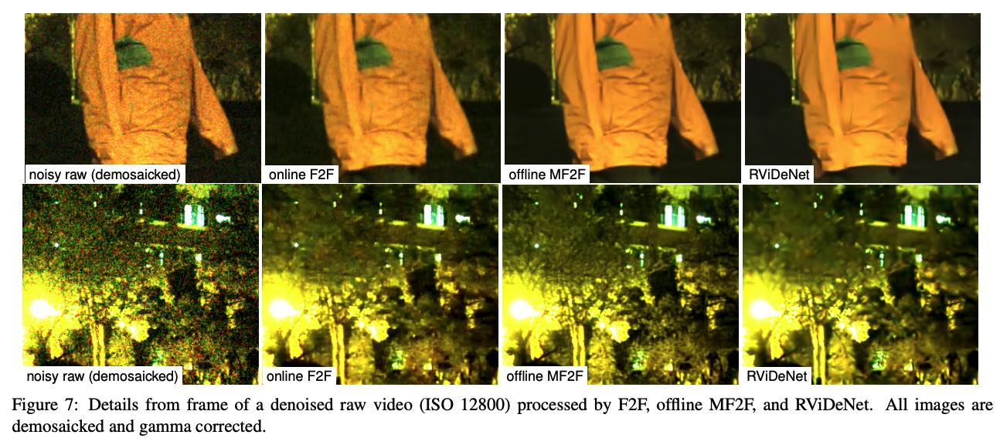

# Self-supervised training for blind multi-frame video denoising

### authors 
Valéry Dewil, Jérémy Anger, Axel Davy, Thibaud Ehret, Gabriele Facciolo and Pablo Arias.

## WACV 2021

-------------------

#### Abstract 

We  propose  a  self-supervised  approach  for  training multi-frame video denoising networks. These networks pre-dict each frame from a stack of frames around it.  Our self-supervised approach benefits from the temporal consistency in the video by minimizing a loss that penalizes the difference between the predicted frame and a neighboring one, after aligning them using an optical flow.  We use the proposed  strategy  to  denoise  a  video  contaminated  with  an unknown  noise  type,  by  fine-tuning  a  pre-trained  denoising network on the noisy video.  The proposed fine-tuning reaches and sometimes surpasses the performance of state-of-the-art  networks  trained  with  supervision.   We  demonstrate this by showing extensive results on video blind denoising of different synthetic and real noises.  In addition,the proposed fine-tuning can be applied to any parameter that controls the denoising performance of the network. We show how this can be expoited to perform joint denoising and noise level estimation for heteroscedastic noise.

#### Materials

[article](https://openaccess.thecvf.com/content/WACV2021/papers/Dewil_Self-Supervised_Training_for_Blind_Multi-Frame_Video_Denoising_WACV_2021_paper.pdf) 

[supplementary material](https://openaccess.thecvf.com/content/WACV2021/supplemental/Dewil_Self-Supervised_Training_for_WACV_2021_supplemental.pdf)

[The code of the proposed method is available here: https://github.com/cmla/mf2f](https://github.com/centreborelli/mf2f)

Dependencies and usage are described in the same page.

